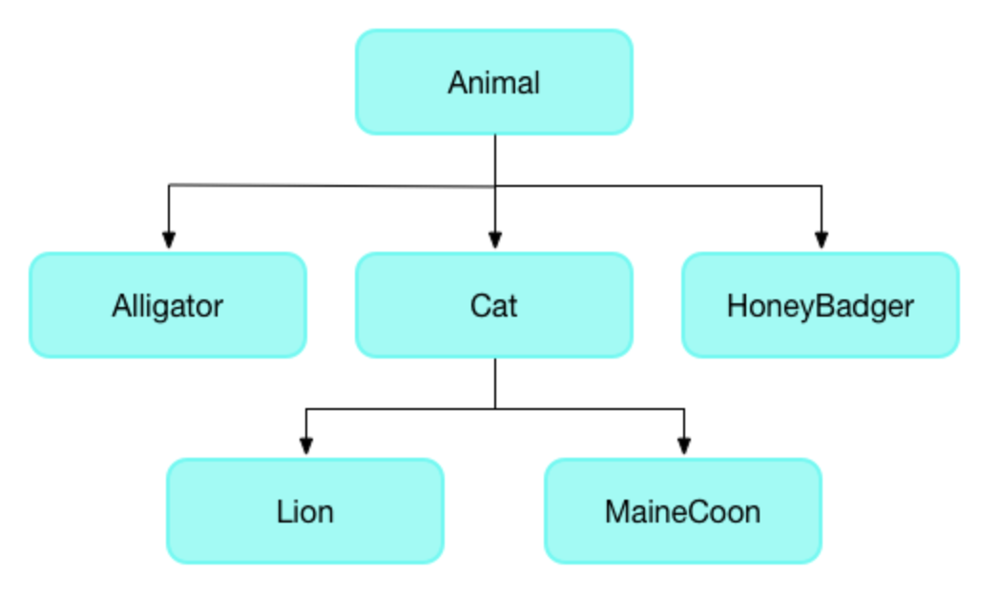
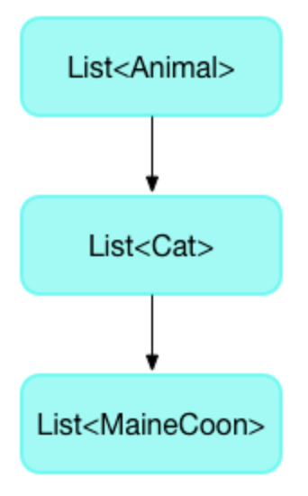
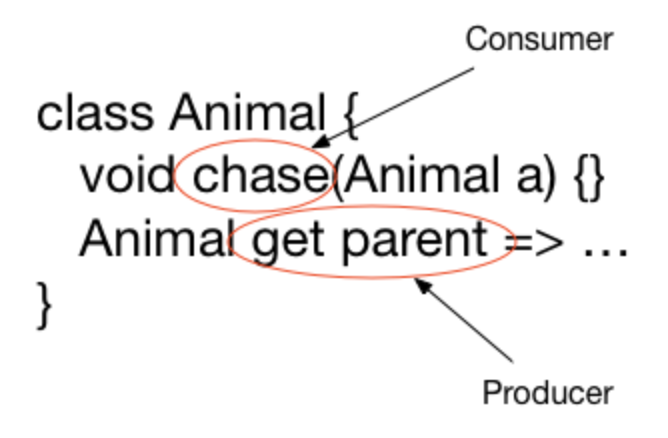

# 09 - 类型系统(Type system)

Dart 语言是类型安全的：它结合了静态类型检查和运行时检查，以确保变量的值始终与变量的静态类型匹配。尽管类型是强制性的，但由于类型推断，类型注释是可选的。

可以通过向泛型类添加类型注释来修复大多数静态分析错误。最常见的泛型类是集合类型 `List<T>` 和 `Map<K，V>`。

例如，在下面的代码中，`printInts()` 函数打印一个整数列表，`main()` 创建一个列表并将其传递给 `printInts`。

```dart
// 静态分析：错误

void printInts(List<int> a) => print(a);

void main() {
  final list = [];
  list.add(1);
  list.add('2');
  printInts(list);
}
```

前面的代码在调用 `printInts(list)` 时导致 `list` 上的类型错误：

```
error - The argument type 'List<dynamic>' can't be assigned to the parameter type 'List<int>'. - argument_type_not_assignable
```

该错误突出显示了从 `List<dynamic>` 到 `List<int>` 的不健全的隐式转换。`list` 变量具有静态类型 `List<dynamic>`。这是因为初始化声明 `var list = []` 没有为分析器提供足够的信息来推断比 `dynamic` 更具体的类型参数。`printInts()` 函数需要 `List<int>` 类型的参数，这会导致类型不匹配。

在创建 `list` 时添加类型注释 `<int>` 时，分析器会抱怨无法将字符串参数分配给 `int` 参数。删除 `list.add('2')` 中的引号会导致代码通过静态分析，并且运行时不会出现错误或警告。

```dart
// 静态分析：成功

void printInts(List<int> a) => print(a);

void main() {
  final list = [];
  list.add(1);
  list.add(2);
  printInts(list);
}
```

## 什么是健全性？（What is soundness?）

健全性是指确保您的程序不会进入某些无效状态。健全的类型系统意味着您永远不会进入表达式的计算结果与表达式的静态类型不匹配的状态。例如，如果一个表达式的静态类型是 `String`，那么在运行时，保证在计算时只会得到 `String`。

Dart的类型系统，就像 Java 和 C# 中的类型系统一样，是健全的。它使用静态检查（编译时错误）和运行时检查的组合来增强这种可靠性。例如，将 `String` 赋值给 `int` 是一个编译时错误。如果对象不是 `String`，则使用 `as String` 将对象强制转换为 `String` 将失败，并出现运行时错误。

## 健全性的好处（The benefits of soundness）

健全的类型系统有几个好处：

- 在编译时显示与类型相关的错误。

  健全的类型系统强制代码明确其类型，因此在运行时可能很难发现的与类型相关的错误在编译时就会被发现。

- 可读性更强的代码。

  代码更容易阅读，因为您可以依赖于实际具有指定类型的值。在健全的 Dart 中，类型不会说谎。

- 更易于维护的代码。

  有了健全的类型系统，当您更改一段代码时，类型系统可以警告您其他刚刚损坏的代码。

- 更好的提前（AOT, ahead of time）编译。

  虽然在没有类型的情况下可以进行AOT编译，但生成的代码效率要低得多。

## 传递静态分析的提示（Tips for passing static analysis）

大多数静态类型的规则都很容易理解。以下是一些不太明显的规则：

- 重写方法时使用合理的返回类型。
- 重写方法时使用合理的参数类型。
- 不要将动态类型的列表用作有具体类型的列表。

让我们通过使用以下类型层次结构的示例来详细了解这些规则：



### 重写方法时使用合理的返回类型

子类中方法的返回类型必须是与超类中方法返回类型相同的类型或子类型。以下面 `Animal` 的 getter 方法为例：

```dart
class Animal {
  void chase(Animal a) { ... }
  Animal get parent => ... // 以这个为例
}
```

`parent` getter 方法返回一个 `Animal`。在 `HoneyBadger` 子类中，您可以将 getter 的返回类型替换为`HoneyBader`（或 `Animal` 的任何其他子类），但不允许使用不相关的类型。

```dart
// 静态分析：成功
class HoneyBader extends Animal {
  @override
  void chase(Animal a) { ... }

  @override
  HoneyBader get parent => ...
}
```

```dart
// 静态分析：错误
class HoneyBader extends Animal {
  @override
  void chase(Animal a) { ... }

  @override
  Root get parent => ...
}
```

### 重写方法时使用合理的参数类型

重写方法的参数必须具有与超类中对应参数相同的类型或超类型。不要通过用原始参数的子类型替换类型来“收紧”参数类型。

> **注意**：如果有正当理由使用子类型，可以使用 [`covariant`](https://dart.dev/guides/language/sound-problems#the-covariant-keyword) 关键字。

以 `Animal` 的 `chase(Animal)` 方法为例：

```dart
class Animal {
  void chase(Animal a) { ... } // 以这个为例
  Animal get parent => ... 
}
```

`chase()` 方法需要一个 `Animal` 参数。`HoneyBadger` 追逐任何东西。可以重写 `chase()` 方法来获取任何东西（`Object`）。

```dart
// 编译分析：成功
class HoneyBadger extends Animal {
  @override
  void chase(Object a) { ... }

  @override
  Animal get parent => ...
}
```

以下代码将 `chase()` 方法上的参数从 `Animal` 收紧为 `Animal` 的子类 `Mouse`。

```dart
// 编译分析：错误

class Mouse extends Animal { ... }

class Cat extends Animal {
  @override
  void chase(Mouse a) { ... }
}
```

此代码不是类型安全的，因为这样就可以定义一只猫并将其发送到鳄鱼之后：

```dart
Animal a = Cat();
a.chase(Alligator());
```

### 不要将动态类型的列表用作有具体类型的列表

当你想要一个包含不同种类的列表时，动态列表是很好的。但是，你不能将动态列表用作类型列表。

此规则也适用于泛型类型的实例。

下面的代码创建了一个 `Dog` 的动态列表，并将其赋值给一个 `Cat` 类型的列表，该列表在静态分析过程中会生成一个错误。

```dart
// 静态分析：错误
void main() {
  List<Cat> foo = <dynamic>[Dog()]; // 错误
  List<dynamic> bar = <dynamic>[Dog(), Cat()]; // OK
}
```

## 运行时检查（Runtime checks）

运行时检查处理在编译时无法检测到的类型安全问题。

例如，以下代码在运行时抛出异常，因为将狗的列表强制转换为猫的列表是错误的：

```dart
// 运行时：错误
void main() {
  List<Animal> animals = [Dog()];
  List<Cat> cats = animals as List<Cat>;
}
```

## 类型推断（Type inference）

分析器可以推断字段、方法、局部变量和大多数泛型类型参数的类型。当分析器没有足够的信息来推断特定类型时，它会使用 `dynamic` 类型。

下面是一个如何使用泛型进行类型推理的示例。在本例中，名为 `arguments` 的变量是一个 map，该 map 将字符串键与各种类型的值配对。

如果显式定义变量类型，可能会这样写：

```dart
Map<String, dynamic> arguments = {'argA': 'hello', 'argB': 42};
```

或者，可以使用 `var` 或 `final`，让 Dart 推断类型：

```dart
var arguments = {'argA': 'hello', 'argB': 42}; // Map<String, Object>
```

map 字面量从其条目推断其类型，然后变量从 map 字面量的类型推断其类型。在这个 map 中，键都是字符串，但值有不同的类型（`String` 和 `int`，它们有最小的共同类型 `Object`）。因此，map 字面量的类型为 `Map<String，Object>`，`arguments` 变量也是如此。

## 字段和方法推断（Field and method inference）

没有指定类型的字段或方法，或者重写超类中的字段或方法，都是继承超类方法或字段的类型。

没有声明或继承但使用初始值声明的字段，会根据初始值获取推断类型。

## 静态字段推断（Static field inference）

静态字段和变量从它们的初始值设定项中推断出它们的类型。注意，如果遇到循环，推理就会失败（也就是说，推断变量的类型取决于知道该变量的类型）。

## 局部变量推断（Local variable inference）

局部变量类型是从它们的初始值设定项推断出来的（如果有的话）。不考虑后续分配。这可能意味着可能会推断出过于精确的类型。如果是，则可以添加类型注释。

```dart
// 静态分析：错误
var x = 3; // x 被推断为 int 类型
x = 4.0;
```

```dart
// 静态分析：成功
num y = 3; // num 可以是 double 或者 int
y = 4.0;
```

## 类型参数推断（Type argument inference）

构造函数调用和泛型方法调用的类型参数是根据发生上下文中的向下信息和构造函数或泛型方法的参数中的向上信息的组合推断的。如果推理没有达到您想要或期望的效果，则可以始终显式指定类型参数。

```dart
// 静态分析：成功

// 推断为所制定的类型 <int>[]
List<int> listOfInt = [];

// 推断为字面量的类型 <double>[]
var listOfDouble = [3.0];

// 推断为 Iterable<int>
var ints = listOfDouble.map((x) => x.toInt())
```

在最后一个示例中，使用向下信息将 `x` 推断为 `double`。闭包的返回类型使用向上信息推断为 `int`。Dart 在推断  `map` 方法的类型参数时使用此返回类型作为向上信息：`<int>`。

## 替换类型（Substituting types）

当您重写一个方法时，您正在用可能具有新类型的东西（在新方法中）替换一个类型的东西（在老方法中）。类似地，当您将参数传递给函数时，您正在将具有一种类型的东西（具有声明类型的参数）替换为具有另一种类型（实际参数）的东西。什么时候可以用有子类型或超类型的东西替换一个类型的东西？

在替代类型时，从消费者和生产者的角度进行思考是有帮助的。消费者吸收一种类型，生产者产生一种类型。

**可以用超类型替换消费者的类型，用子类型替换生产者的类型。**

### 简单类型分配（Simple type assignment）

将对象指定给对象时，何时可以将类型替换为其他类型？答案取决于对象是消费者还是生产者。

考虑以下类型层次结构：


考虑以下简单的赋值，其中 `Cat c` 是消费者，`Cat()` 是生产者：

```dart
Cat c = Cat();
```

在消费者位置，用消耗任何东西的东西（`Animal`）代替消耗特定类型的东西（`Cat`）是安全的，所以用 `Animal c` 代替 ` Cat c` 是允许的，因为 `Animal` 是 `Cat` 的父类。

```dart
// 静态分析：成功
Animal c = Cat();
```

但是用 `MaineCoon c` 替换 `Cat c` 会破坏类型安全，因为父类可能会为一种类型的 `Cat` 提供不同的行为，例如 `Lion`：

```dart
// 静态分析：错误
MaineCoon c = Cat();
```

在生产位置，用更具体的类型（`MaineCoon`）替换生产类型（`Cat`）的东西是安全的。因此，允许以下情况：

```dart
// 静态分析：成功
Cat c = MaineCoon();
```

### 泛型类型分配（Generic type assignment）

泛型类型的规则相同吗？对。考虑动物列表的层次结构—— `List<Cat>` 是 `List<Animal>` 的子类型，也是 ` List<MaineCoon>` 的父类型：



在以下示例中，您可以将 `List<MaineCoon>` 分配给 `myCats`，因为`List<MaineCoon>` 是 `List<Cat>` 的子类型：

```dart
// 静态分析：成功
List<MaineCoon> myMaineCoons = ...
List<Cat> myCats = myMaineCoons;
```

往另一个方向走怎么样？您能将 `List<Animal>` 分配给 `List<Cat>` 吗？

```dart
// 静态分析：错误
List<Animal> myAnimals = ...
List<Cat> myCats = myAnimals;
```

此赋值不通过静态分析，因为它创建了隐式下转换，而非 `dynamic` 类型（如 `Animal`）不允许这样做。

要使这种类型的代码通过静态分析，可以使用显式强制转换。

```dart
List<Animal> myAnimals = ...
List<Cat> myCats = myAnimals as List<Cat>;
```

不过，显式强制转换在运行时可能仍然失败，这取决于要强制转换的列表的实际类型（`myAnimals`）。

### 方法（Method）

重写方法时，生产者和消费者规则仍然适用。例如：



对于使用者（例如 `chase(Animal)` 方法），可以将参数类型替换为父类型。对于生产者（例如 `parent` getter方法），可以用子类型替换返回类型。
