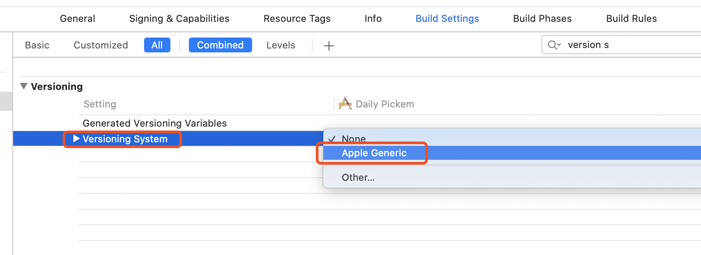

# 08 - 打包和分发

## 打包

Fastlane 有一个 action 用于打包，`gym` ，是 `build_ios_app` 的别名。链接为：[gym - fastlane docs](https://docs.fastlane.tools/actions/gym/)

### 用法

为了不直接把相关参数直接传入 lane 中，所以我们先执行 `fastlane gym init`，然后会在 fastlane 文件夹中生成一个文件 Gymfile，把文件内容替换为：
```ruby
clean true # 打包前是否需要 clean
scheme "MyFirstApp" # Xcode 左上角显示的 Scheme 名称
```

接着我们可以编写打包 ad-hoc 类型的 lane：

```ruby
lane :build_adhoc do
  gym(
    output_directory: "build_Adhoc",
    export_method: "ad-hoc"
  )
end
```

编写打包 app-store 类型的 lane：

```ruby
lane :build_appstore do
  gym(
    output_directory: "build_Appstore",
    export_method: "app-store"
  )
end
```

### increment_build_number action

在打包的时候，通常我们要更新build 的版本号。Fastlane 提供了 `increment_build_number` ，文档链接：[increment_build_number - fastlane docs](https://docs.fastlane.tools/actions/increment_build_number/#increment_build_number)。默认情况下他会自动加 1，也可以自己设置版本号。

在Xcode 中还有一个地方要设置. 默认情况下,Xcode 没有使用任何的版本号系统，所以要让 `increment_build_number` 工作，我们需要做一些设置。在 `Build Settings` 中找到 `Versioning System`,把它改为 `Apple Generic`，这样就可以了。



## 分发到 TestFlight

Fastlane 有一个 action 用于分发到 TestFlight，`pilot` ，是 `upload_to_testflight` 的别名。链接为：[pilot - fastlane docs](https://docs.fastlane.tools/actions/pilot/)

以下是一些常用命令：
	- 上传包到 App Store Connect：  `fastlane pilot upload`
	- 查看已经上传的包： `fastlane pilot builds`
	- 查看所有测试用户：`fastlane pilot list`
	- 查看特定测试用户的信息：`fastlane pilot find lebron@test.com`

一个简单的 lane 编写如下：

```ruby
lane :distribute_to_appstore do
  build_appstore
  pilot(
    team_name: "Team Lebron",
    notes: "Version {lane_context[SharedValues::VERSION_NUMBER]}, Build {lane_context[SharedValues::BUILD_NUMBER]}"
  )
end
```

更详细的使用教程请查看 [pilot - fastlane docs](https://docs.fastlane.tools/actions/pilot/)的 Examples 部分。其中的 `lane_context` 可以读取其他 actions 生成的信息，具体可以查看[Lanes - fastlane docs](https://docs.fastlane.tools/advanced/lanes/#lane-context)

## 生成专用密码
在一个[苹果账号管理页面](https://appleid.apple.com/account/manage)专用密码，放到 `.bash_profile` 文件中：
```
export FASTLANE_APPLE_APPLICATION_SPECIFIC_PASSWORD="xxxx"
```
