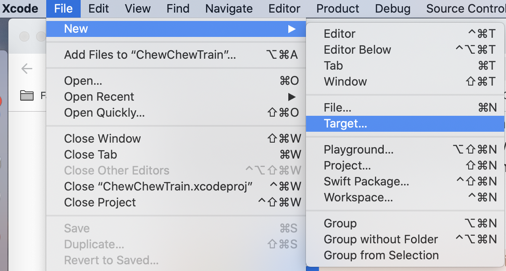
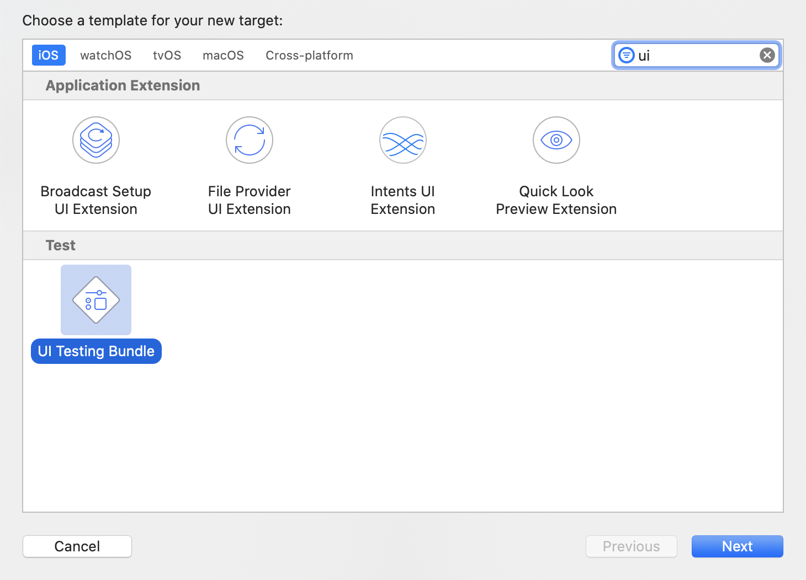
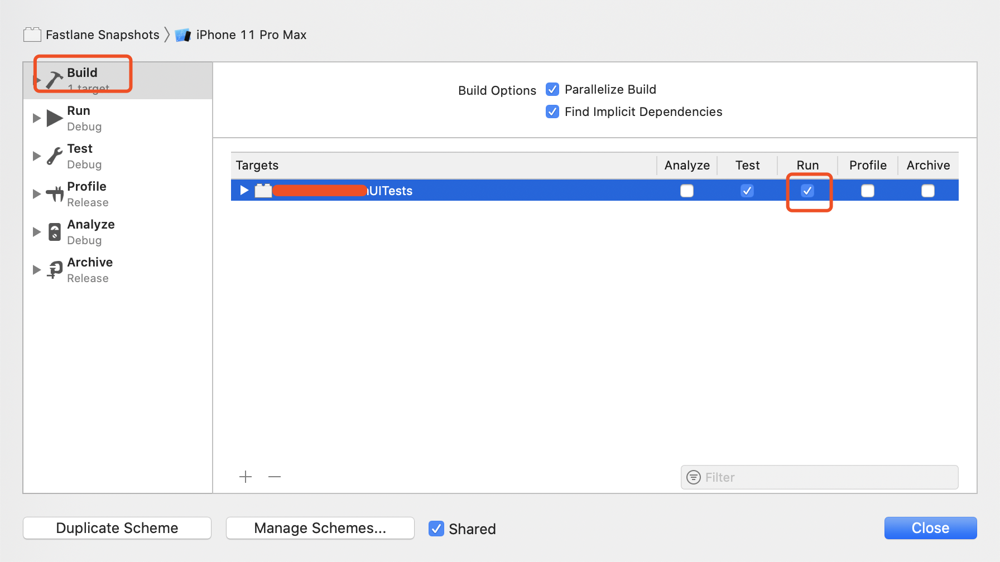

# 10 - 截图

在应用提交审核之前，需要准备截图，通常我们要手动去做。 Fastlane的 `snapshot` action 可以帮助我们解决这个问题。文档链接：[snapshot - fastlane docs](https://docs.fastlane.tools/actions/snapshot/) 。它是通过 UITest 来实现的。

## 用法

1. 首先要有一个 UITest Target。如果项目中已经有 UI 测试,则可以跳过这一个,没有则去创建一个





3. 创建一个新的 scheme：Taraget 选项选择刚刚创建的 UITest Target，Name 参数填写 `Fastlane Snapshots`。
4. 让刚刚创建的 scheme 支持 run，如下图那个位置勾上：



4. 执行 `fastlane snapshot init`，在 fastlane 目录会生成 `Snapfile` 和 `SnapshotHelper.swift` 文件.
5. 把 `SnapshotHelper.swift` 文件添加到 UITest Target，然后在tests 文件的 `setUp()` 方法加上以下代码：

```swift
let app = XCUIApplication()
setupSnapshot(app)
app.launch()
```

6. 录制 UI 测试，然后在需要截图的地方使用 snapshot 截图，例如：

```swift
func testSnapshot() {
    let app = XCUIApplication()
    snapshot(“1launch”)
    app.buttons[“How’s it Work?”].tap()
    snapshot(“2HowItWorks”)
    app.buttons[“Sounds Fun!”].tap()
    snapshot(“3SoundsFun”)
}
```

7. 配置 `Snapfile`：

```ruby
scheme(“Fastlane Snapshots”)

devices([
  “iPhone 8 Plus”
  “iPhone Xs”,
  “iPhone Xs Max”,
])

languages([
  “en-US",
  “es-ES”
])

stop_after_first_error true
erase_simulator true
clear_previous_screenshots true
reinstall_app true
```

8. 终端执行 `fastlane snapshot` 就可以截图了，截图相关文件存储在 `fastlane/screenshots`。

## lane

lane的编写如下：

```ruby
lane :release do
    snapshot
    precheck
  end
```
