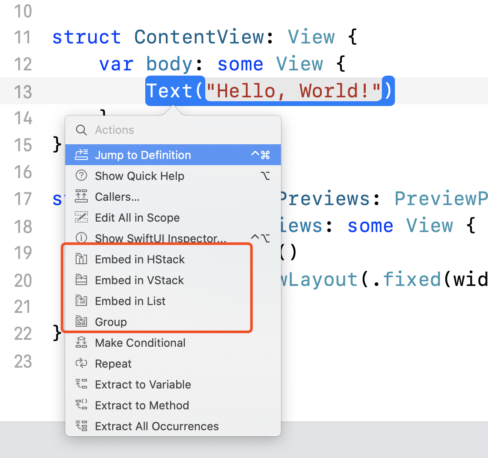
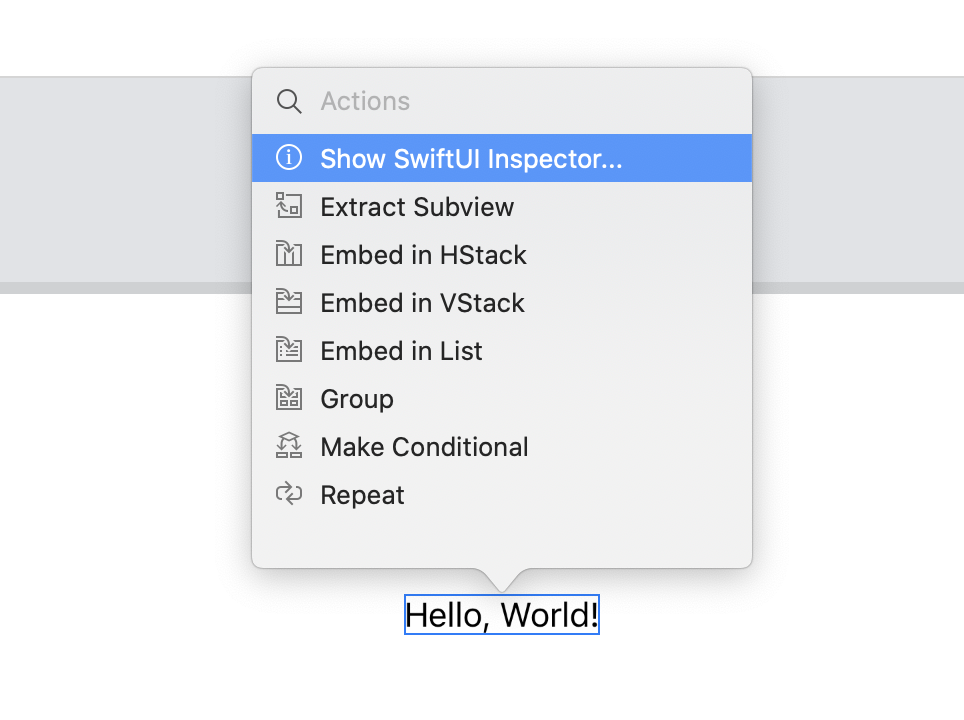
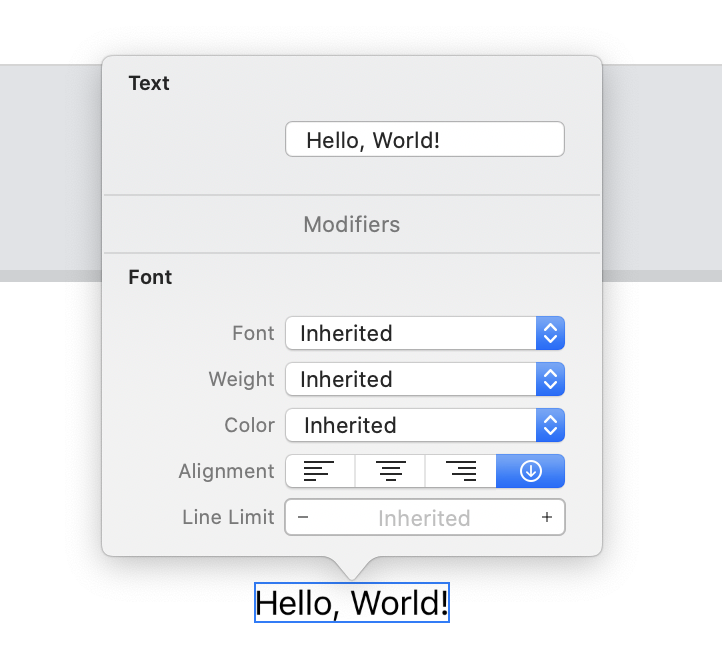

## 新项目创建的变化

`AppDelegate` 被分成了两个部分：`AppDelegate` 和 `SceneDelegate`。

### `AppDelegate`

### `SceneDelegate`

`window` 属性被放到了这里，并且它的初始化也被放到了这个方法 `func scene(_ scene: UIScene, willConnectTo session: UISceneSession, options connectionOptions: UIScene.ConnectionOptions)`。如果是使用 storyboard，`window` 会自动初始化，并且附加到提供的 `scene`；如果不使用 storyboard，则手动配置的代码如下(创建项目过程中 interface 选择 Swift 时，Xcode 自动生成的代码)：

```swift
let contentView = ContentView()

if let windowScene = scene as? UIWindowScene {
    let window = UIWindow(windowScene: windowScene)
    window.rootViewController = UIHostingController(rootView: contentView)
    self.window = window
    window.makeKeyAndVisible()
}
```

`UIHostingController` 可以让我们把 SwiftUI 的 view 集成到现用的应用中。

## UI 的创建或修改方式

SwiftUI 没有 storyboard 或者 view controller，我们可以通过以下方式创建或修改 UI:

1. 直接在 `View` 的 `body` 中编写控件:

```swift
struct ContentView: View {
    var body: some View {
        Text("Hello, World!")
    }
}
```

2. 通过拖拽的方式把控件拖到 `body` 中想要插入的位置：


3. 把鼠标放在控件上，按住 Command 键 + 单击，可以添加一些 Container View：



4. 在预览上，把鼠标放在控件上，按住 Command 键 + 单击，选择 Show SwiftUI Inspector，可以修改 View 的相关属性(准确地说应该是使用不同的 Modifiers 在原有的基础上创建新的 View，但是给我们的感觉就是像修改属性一样)：

 
