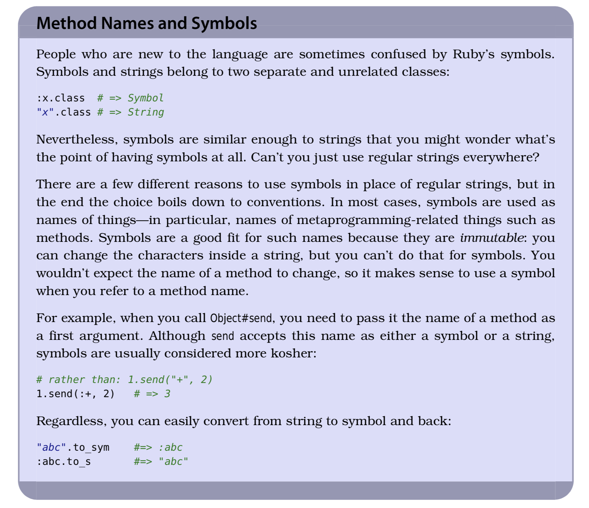

# 03 Methods

## 1. String 和 Symbol 的区别



## 2. 动态调用方法

```ruby
def refresh(options = {})
  defaults = {}
  attributes = [:input, :output, :commands, :print, :quiet,
                :exception_handler, :hooks, :custom_completions,
                :prompt, :memory_size, :extra_sticky_locals]

  attributes.each do |attribute|
    defaults[attribute] = Pry.send attribute
  end

  defaults.merge!(options).each do |key, value|
    send("#{key}=", value) if respond_to?("#{key}=")
  end

  true
end
```

## 3. 定义动态方法

```ruby
class Computer
  def initialize(computer_id, data_source)
    @id = computer_id
    @data_source = data_source
    data_source.methods.grep(/^get_(.*)_info$/) { Computer.define_component $1 }
  end

  def self.define_component(name)
    define_method(name) do
      # ...
    end
  end
end
```

## 4. 重写 `method_missing` 的同时，重写 `respond_to_missing?`。直接重写 `respond_to?` 是不太好的做法。

## 5. 如果想要一个空白的类，可以继承自`BasicObject`。

## 6. The choice between **Dynamic** and **Ghost** Methods : *use Dynamic Methods if you can and Ghost Methods if you have to*. 
