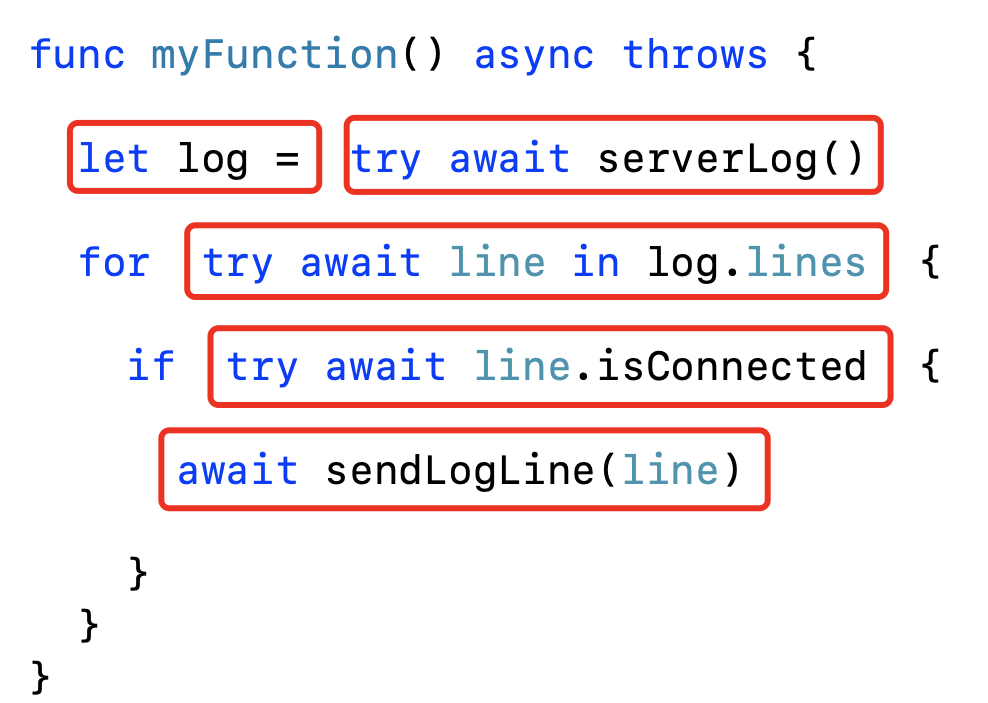
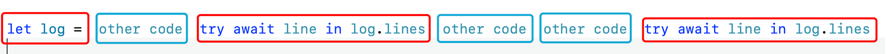
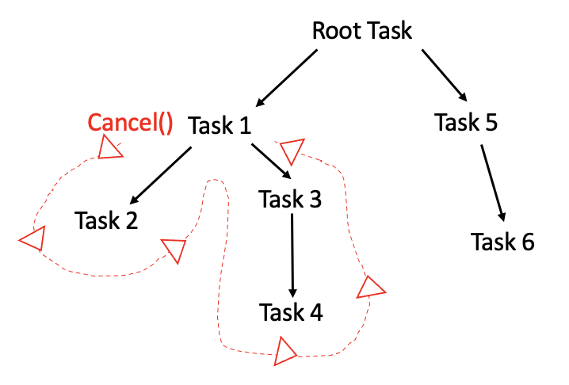
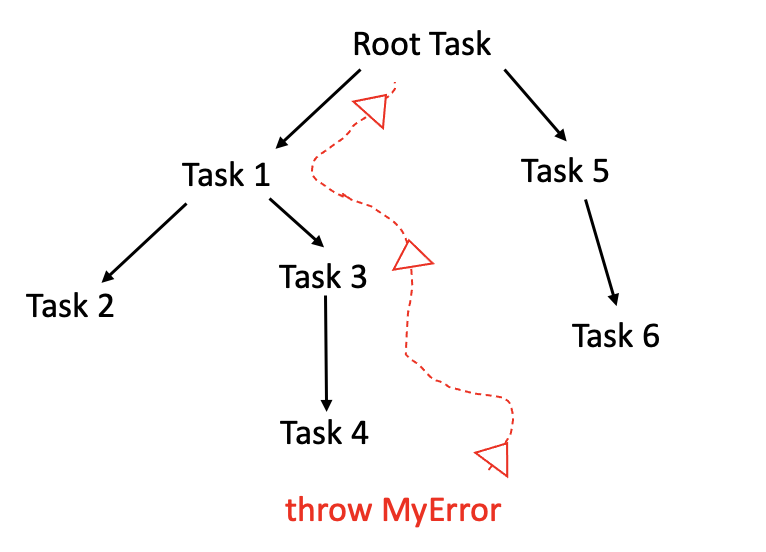

# 02 - 从 async/await 开始

## async/await 之前的异步

在 Swift 5.5 之前，编写异步代码有许多缺点。请看以下示例：

```swift
class API {
  func fetchServerStatus(completion: @escaping (ServerStatus) -> Void) {
    URLSession.shared
      .dataTask(
        with: URL(string: "http://amazingserver.com/status")!
      ) { data, response, error in
        // Decoding, error handling, etc
        let serverStatus = ...
        completion(serverStatus)
      }
      .resume()
  }
}

class ViewController {
  let api = API()
  let viewModel = ViewModel()

  func viewDidAppear() {
    api.fetchServerStatus { [weak viewModel] status in
      guard let viewModel = viewModel else { return }
      viewModel.serverStatus = status
    }
  }
}
```

这是一小段代码，调用网络 API 并将结果赋值给 ViewModel 的属性。它看似简单，但却展示了一种难以忍受的形式，模糊了你的意图。更糟糕的是，它为编码错误创造了很大的空间：你是否忘记检查错误？你真的在每个代码路径中调用了 `completion` 闭包吗？

自己阅读上面的代码。可能会注意到：

- 编译器无法清楚地知道在 `fetchServerStatus()` 中调用 `completion` 的次数。因此，它无法优化其寿命和内存使用。
- 你需要自己处理内存管理，方法是捕获 `viewModel`，然后检查代码，查看它是否在闭包运行之前被释放。
- 编译器无法确保你已处理错误。

Swift 中的现代并发模型与编译器和运行时密切配合。它解决了许多问题，包括上面提到的问题。

现代并发模型提供了以下三种工具来实现与上述示例相同的目标：

- **async**：指示方法是异步的。使用它可以暂停执行，直到异步方法返回结果。
- **await**：指示代码在等待 `async` 的方法返回时可能会暂停执行。
- **Task**：异步工作的一个单元。你可以等待任务完成，也可以在任务完成之前取消它。

以下是使用 Swift 5.5 中引入的现代并发功能重写上述代码：

```swift
class API {
  func fetchServerStatus() async throws -> ServerStatus {
    let (data, _) = try await URLSession.shared.data(
      from: URL(string: "http://amazingserver.com/status")!
    )
    return ServerStatus(data: data)
  }
}

class ViewController {
  let api = API()
  let viewModel = ViewModel()

  func viewDidAppear() {
    Task {
      viewModel.serverStatus = try await api.fetchServerStatus()
    }
  }
}
```

上面的代码的行数与前面的示例大致相同，但对编译器和运行时来说，其意图更为明确：

- `fetchServerStatus()` 是一个异步函数，可以挂起和恢复执行。使用 `async` 关键字对其进行标记。
- `fetchServerStatus()` 返回数据或抛出错误。这是在编译时检查的 --- 不再担心忘记处理错误的代码路径！
- `Task` 在异步上下文中执行给定的闭包，以便编译器知道在该闭包中编写什么代码是安全的（或不安全的）。
- 最后，每次使用 `await` 关键字调用异步函数时，您都可以让运行时暂停或取消代码。这使系统能够不断更改当前任务队列中的优先级。

## 将代码分成部分任务

上面提到了“代码可能在每次等待时挂起”-但这意味着什么？为了优化共享资源，如 CPU 内核和内存，Swift 将代码拆分为称为部分任务 (partial tasks)的逻辑单元。它们表示希望异步运行的部分代码。



Swift 运行时分别为异步执行调度这些部分任务。当每个部分任务完成时，系统根据系统负载和挂起任务的优先级决定是继续使用代码还是执行另一个任务。

这就是为什么必须记住这些 `await` 标记的部分任务中的每一个都可能由系统自行决定在不同的线程上运行。不仅线程可以改变，而且你不应该在 `await` 之后对应用程序的状态做出假设；虽然两行代码一行接一行出现，但它们可能会间隔一段时间执行。等待的时间是任意的，同时应用程序状态可能会发生显著变化。

### 执行部分任务

与开头提到的闭包语法相反，现代并发语法是轻巧的。使用的关键字（如 `async`、 `await` 和 `let` ）清楚地表达了意图。并发模型的基础是将异步代码分解为在执行器 (Executor) 上执行的部分任务。



Executor 似于 GCD 队列，但它更强大，更底层。此外，它们可以快速运行任务，并完全隐藏执行顺序、线程管理等复杂性。

## 控制任务的生命周期

现代并发的一个重要新特性是系统能够管理异步代码的生命周期。

现有多线程 API 的一个巨大缺点是，一旦异步代码开始执行，系统就无法优雅地回收CPU 核心，直到代码决定放弃控制。这意味着，即使在一项工作不再需要之后，它仍然会消耗资源并毫无理由地执行其工作。

一个很好的例子是从远程服务器获取内容的服务。如果您调用此服务两次，系统就没有任何自动机制来回收第一次调用（现在不需要的调用）使用的资源，这是不必要的资源浪费。

新模型将代码分解为多个部分，在进入运行时时提供挂起点。这使系统不仅可以暂停代码，还可以自行取消代码。

由于新的异步模型，当取消给定的任务时，运行时可以沿着异步层次结构向下走，并取消所有子任务。



但是，如果您有一项艰巨的任务，在没有任何暂停点的情况下执行冗长乏味的计算，该怎么办？对于这种情况，Swift 提供 API 来检测当前任务是否已取消。如果是这样，可以手动放弃它的执行。

最后，挂起点还为错误提供了一个转义路径，从而使层次结构向上冒泡到捕获和处理错误的代码。



新模型提供了一个类似于同步函数的错误处理基础结构，使用了现代的抛出函数。它还优化了任务抛出错误时的快速内存释放。

## async/await 的使用

### 函数

要将函数声明为异步函数，在 `throws` 或返回类型之前添加 `async` 关键字。在前面添加 `await` 来调用函数，如果函数 `throws`，使用 `try`。例子：

```swift
func myFunction() async throws -> String {
  // ...
}

let myVar = try await myFunction()
```

### 计算属性

要使计算属性异步，只需将 `async` 添加到 getter，并通过前面加上 `await` 来访问该值，如下所示：

```swift
var myProperty: String {
  get async {
    // ...
  }
}

print(await myProperty)
```

### 闭包

```swift
func myFunction(worker: (Int) async -> Int) -> Int {
  // ...
}

myFunction {
  return await computeNumbers($0)
}
```

## 调用异步函数的几种方式

### 在 `task` modifier 中调用异步函数

`task` 是一个 view modifier，允许在 view appear 时执行异步代码。它还处理在 view disappear 时取消异步执行：

```swift
.task {
  do {
    let myVar = try await myFunction()
  } catch {
    let lastErrorMessage = error.localizedDescription
  }
}
```

### 使用 `Task`

```swift
Task {
  do {
    let myVar = try await myFunction()
  } catch {
    let lastErrorMessage = error.localizedDescription
  }
}
```

`Task` 是表示顶层异步任务的类型。作为顶层意味着它可以创建一个异步上下文 —— 可以从同步上下文开始。当要从同步上下文运行异步代码时，都需要一个新 `Task`。

可以使用以下 API 手动控制任务的执行：

- `Task(priority:operation)`: 为异步执行安排具有给定优先级的 `operation`。它从当前同步上下文继承默认值。
- `Task.detached(priority:operation)`: 与 `Task(priority:operation)` 类似，除了它不继承调用上下文的默认值之外。
- `Task.value`: 等待任务完成，然后返回其值，类似于其他语言中的 promise。
- `Task.isCancelled`: 如果自上一个暂停点以来已取消任务，则返回 `true`。可以检查此布尔值以了解何时应停止执行计划的工作。
- `Task.checkCancellation()`: 如果任务已取消，则抛出 `CancellationError` 错误。这允许函数使用错误处理基础结构来产生执行。
- `Task.sleep(nanoseconds:)`: 使任务睡眠至少达到给定的纳秒数，但在此期间不会阻塞线程。

## 合并多个无依赖关系的异步函数调用

假设有以下两个调用：

```swift
let files = try await model.availableFiles()
let status = try await model.status()
```

这两个调用都是异步的，理论上可以同时发生，因为它们之间没有任何依赖。但是，通过显式地将它们标记为 `await`，对 `status()` 的调用需要等到对 `availableFiles()` 的调用完成后才会开始。

Swift 提供了 `async let` 来解决这个问题。

```swift
async let files = try model.availableFiles()
async let status = try model.status()

let (filesResult, statusResult) = try await (files, status)
```

`async let` 允许我们创建与其他语言中的 **promise** 概念类似的本地常量。

为了读取 `async let` 创建的常量的值，需要使用 `await`。如果该值已经可用，将立即获得它。否则，代码将在等待时挂起，直到结果可用。

要对 `async let` 创建的常量进行分组并提取其值，有两个方法：

- 用集合（如数组）对它们进行分组。
- 将它们作为 tuple 包装在括号中，然后对结果进行分解。

例如：

```swift
let (filesResult, statusResult) = try await (files, status)
```

此时，如果 `await` 没有抛出错误，那么 `async let` 创建的常量就成功解析。

## @MainActor

让代码在主线程上运行，可以使用：

```swift
await MainActor.run {
  // UI 代码
}
```

但如果频繁使用，会导致太多的闭包。这时可以使用 `@MainActor`：

```swift
@MainActor
func updateUI() {
  // UI 代码
}

// 调用
await updateUI()
```
