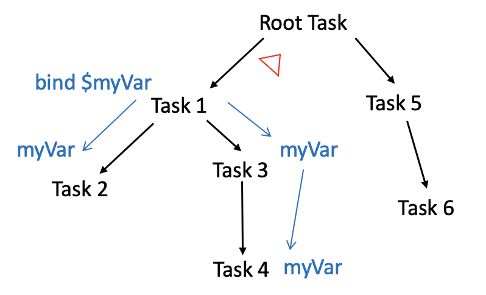

# 03 - 异步序列和中间任务

## 了解异步序列 (`AsyncSequence`)

`AsyncSequence` 是描述可以异步生成元素的序列的协议。从表面看，它的 API 与 Swift 标准库的 `Sequence` 相同，但有一个区别：你需要 `await` 下一个元素，因为它可能不会像在 `Sequence` 中那样立即可用。

以下是一些常见的需求，可以使用异步序列：

- 使用 `await` 在 `for` 循环中对序列进行迭代，如果 `AsyncSequence` 抛出错误，使用 `try`，请重试。代码在每次循环迭代时挂起以获取下一个值：

```swift
for try await item in asyncSequence {
  ...
}
```

- 使用带有 `while` 循环的标准库迭代器的异步方法。这类似于使用同步序列：需要生成一个迭代器，并使用 `await` 重复调用 `next()`，直到序列结束：

```swift
var iterator = asyncSequence.makeAsyncIterator()
while let item = try await iterator.next() {
  ...
}
```

- 使用标准序列方法，如 `dropFirst(_:)`、`prefix(_:)` 和 `filter(_:)`：

```swift
for await item in asyncSequence
  .dropFirst(5)
  .prefix(10)
  .filter { $0 > 10 }
  .map { "Item: \($0)" } {
    ...
  }
```

- 使用特殊的原始字节序列包装器，例如用于文件内容或从服务器 URL 获取时：

```swift
let bytes = URL(fileURLWithPath: "myFile.txt").resourceBytes

for await character in bytes.characters {
  ...
}

for await line in bytes.lines {
  ...
}
```

- 在自己的类型中遵循 `AsyncSequence` 协议来创建自定义序列。

- 利用 `AsyncStream` 创建自己的自定义异步序列。

## 取消任务

取消不需要的任务对于并发模型的高效工作至关重要。

当使用新的 API 时，比如 `TaskGroup` 或 `async let`，系统通常可以在需要时自动取消任务。

但是，可以通过使用以下 `Task` API 为基于任务的代码实现更细粒度的取消策略：

- `Task.isCancelled`：如果任务仍处于活动状态，但自上次暂停点以来已取消，则返回 `true`。
- `Task.currentPriority`：返回当前任务的优先级。
- `Task.cancel()`：尝试取消任务及其子任务。
- `Task.checkCancellation()`：如果任务被取消，则抛出`CancellationError`，从而更容易退出抛出上下文。
- `Task.yield()`：暂停当前任务的执行，使系统有机会自动取消该任务以执行其他具有更高优先级的任务。

## @TaskLocal

每个异步任务都在其自己的上下文中执行。但一个任务可以调用其他任务。因为每个函数都可能与许多不同的函数交互，所以在运行时隔离共享数据可能很困难。

为了解决这个问题，Swift 提供了一个新的属性包装器 `@TaskLocal`，将给定的属性标记为 **task-local**。

在 SwiftUI 中将对象注入到环境中，这样不仅可以使对象的对直接视图可用，还可以对其所有子视图可用。类似地，绑定 `task-local` 的值不仅可用于直接任务，还可用于其所有子任务：



`@TaskLocal` 属性包装器提供了一个名为 `withValue()` 的方法，可以将值绑定到异步任务，或者简单地说，将其注入到任务层次结构中。

例如：

```swift
final class ViewModel: ObservableObject {
  @TaskLocal
  var supportsPartialDownloads = false

  func downloadFile(_ file: File) async throws -> Data {
    // 根据 Self.supportsPartialDownloads 的值进行不同的下载逻辑
  }
}

// 在 View 中调用
try await ViewModel
  .$supportsPartialDownloads
  .withValue(file.name.hasSuffix(".jpeg")) {
    fileData = try await model.downloadFile(file)
  }
```

> **注意**：task-local 属性的类型需要是静态的，或者是全局变量。

可以通过这种方式绑定多个值，也可以覆盖内部绑定中的值，如下所示：

```swift
try await $property1.withValue(myData) {
  ...
  try await $property2.withValue(myConfig1) {
    ...
    try await serverRequest()
    try await $property2.withValue(myConfig2) {
      ...
    }
  }
}
```

使用太多的 task-local 属性可能会变得难以阅读和解释，因为需要为每个绑定将代码包装在一个闭包中。

**注意**：从这个意义上讲，task-local 属性对于绑定较少的值很有用：完整的配置对象或整个数据模型，而不是像上面的示例中那样单独的单个值或标志。
