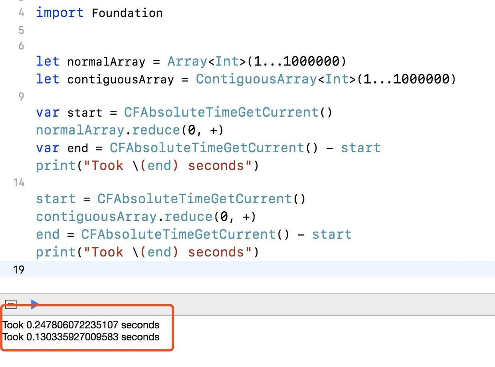

书籍链接：[《Pro Swift》](https://gumroad.com/l/proswift) (链接需要梯子才能打得开)。

### 一、很有用的初始化函数

#### 1. `repeating:count:`

当我们想重复某个值时，可以使用`repeating:count:`。

例如，在一个标题下面加上一串等号：

```swift
let heading = "This is a heading"
let underline = String(repeating: "=", count: heading.count)

// 结果
This is a heading
=================
```

创建10x10的空字符串二维数组：

```swift
var board = [[String]](repeating: [String](repeating: "", count: 10), count: 10)
```

#### 2. 数字与字符串的转换

将数字转换成某种进制，并以字符串表示：

```swift
let str1 = String(28, radix: 16)
// str1 = "1c"

// 如果想要转换成大写
let str2 = String(28, radix: 16, uppercase: true)
// str2 = "1C"
```

#### 3. 剔除数组中重复的元素

使用`Set`的初始化函数来快速实现，因为`Set`里面的元素是唯一的：

```swift
let scores = [5, 3, 6, 1, 3, 5, 3, 9]
let scoresSet = Set(scores) // 剔除重复值
let uniqueScores = Array(scoresSet)
```

#### 4. 字典的容量

在我们创建一个字典的时候，如果我们确定这个字典的最小容量，我们优先使用`minimumCapacity:`：

```swift
var dictionary = [String: String](minimumCapacity: 100)
```

如果不使用最小容量去创建，Swift会默认开辟一定大小的空间，在使用过程中，如果不够，再去申请更多内存，这样频繁申请的话，会一定程度的降低性能。如果我们创建的时候就告诉Swift我们最小容量，这样就能尽量保证在使用字典过程中，不会频繁地去申请更多的内存，提高程序的性能。当然，如果实际使用中超过了我们指定的最小容量，Swift还是会自动申请内存的。Swift是以`2`的次幂去申请内存的，例如我们这里指定最小容量是`100`，他会创建`128`的容量。

#### 5. Enum的使用

在使用Enum的某个case时，可以省略Enum的名称，代码更简洁：

```swift
enum Color {
   case unknown, blue, green, pink, purple, red
}

struct Toy {
   let name: String
   let color: Color
}

let barbie = Toy(name: "Barbie", color: .pink)
let raceCar = Toy(name: "Lightning McQueen", color: .red)
```

除了Enum之外，类型属性也可以用这种方式，例如我们常用的通知：

```swift
NotificationCenter.default.addObserver(self,
                                       selector: #selector(appDidEnterBackground),
                                       name: .UIApplicationDidEnterBackground,
                                       object: nil)
```

### 二、数组

如果数组元素类型实现了`Comparable`协议，我们可以使用`sorted()`和`sort()`来排序，`sorted()`返回经过排序的数组，而`sort()`会对原有数组进行排序。

```swift
var names = ["Taylor", "Timothy", "Tyler", "Thomas", "Tobias", "Tabitha"]
let sorted = names.sorted()


// 排序后sorted = ["Tabitha", "Taylor", "Thomas", "Timothy", "Tobias", "Tyler"]
```

另外还可以使用`min()`和`max()`来求最小值和最大值。

```swift
let numbers = [5, 3, 1, 9, 5, 2, 7, 8]
let lowest = numbers.min()
let highest = numbers.max()
```

#### 1. 添加或删除数组元素

我们经常用`append()`、`insert()`和`remove(at:)`等函数对数组元素进行操作。

其实我们还可以用`+`和`+=`进行添加元素：

```swift
let poppy = Dog(breed: "Poodle", age: 5)
let rusty = Dog(breed: "Labrador", age: 2)
let rover = Dog(breed: "Corgi", age: 11)
var dogs = [poppy, rusty, rover]

let beethoven = Dog(breed: "St Bernard", age: 8)
dogs += [beethoven]
```

如果我们想删除最后一个元素，可以使用`removeLast()`和`popLast()`。但他们的不同之处在于：1) 使用`removeLast()`的前提是数组中至少有一个元素，否则程序会crash；2) 而`popLast()`则不会有问题，尽管是空数组，也不会crash。`removeLast()`对应有一个`removeFirst()`，而`popLast()`则没有。

#### 2. 数组容量和是否为空

判断数组是否为空，使用更简短的`isEmpty`即可，不必使用`array.count == 0`。

如果我们能确定数组要存储的元素个数，在初始化数组的时候就可以使用`reserveCapacity()`指定数组的容量，这样Swift就可以在内存中开辟一块连续的内存地址，尽量避免了不必要的多次开辟内存空间和移动数组元素。当然，如果后面元素个数操作了之前指定的数组容量，也是没有问题的。

`reserveCapacity()`的运行时间是`O(n)`，`n`是数组的个数。所以我们在添加元素之前，要先调用这个方法。

#### 3. `ContiguousArray`

根据苹果的官方文档：`ContiguousArray`总是会把它的元素存储在内存的连续区域。如果数组元素是class类型或者遵循`@objc`协议、或者数组不需要把桥接到`NSArray`、或者不需要暴露给Objective-C使用，使用`ContiguousArray`将会有更高的性能。

另外还说到：如果数组元素是Struct或者Enum，`Array`和`ContiguousArray`有类似的性能。可是经过测试，还是有比较大的区别的: 使用`Array`和`ContiguousArray`分辨创建包含1到1百万的的数组，并计算所有元素的和，使用`Array`的时间大概是`0.25s`，而使用`ContiguousArray`的时间大概是`0.13s`。




### 三、字典

用`mapValues()`改变key对应的value：

```swift
let cities = ["Shanghai": 24_256_800, "Karachi": 23_500_000, "Beijing": 21_516_000, "Seoul": 9_995_000];
let roundedCities = cities.mapValues { "\($0 / 1_000_000)million people" }
// roundedCities = ["Shanghai": "24million people", "Karachi": "23million people", "Beijing": "21million people", "Seoul": "9million people"]
```

用分组初始化函数对原有字典进行分组：

```swift
// 根据key的首字母进行分组
let groupedCities = Dictionary(grouping: cities.keys) { $0.first! }
print(groupedCities)
// ["B": ["Beijing"], "S": ["Shanghai", "Seoul"], "K": ["Karachi"]]

// 根据key的长度进行分组
let groupedCities = Dictionary(grouping: cities.keys) { $0.count }
print(groupedCities)
// [5: ["Seoul"], 7: ["Karachi", "Beijing"], 8: ["Shanghai"]]
```

访问某个值，并且提供一个默认值：

 ```swift
let person = ["name": "Taylor", "city": "Nashville"]
let name = person["name", default: "Anonymous"] // 如果"name"对应的值为空，那么变量`name`为"Anonymous"
 ```
 
 有些同学可能会说，我用这种形式写也行：
 
 ```swift
 let name = person["name"] ?? "Anonymous"
 ```
 
 没错，但是使用`person["name", default: "Anonymous"]`这种形式访问键对应的值还是有好处的。如果`name`对应的值为空，他可以把我们提供的默认值赋给`name`对应的值，例如，统计`favoriteTVShows`数组中每个TV shows出现的次数：
 
 ```swift
var favoriteTVShows = ["Red Dwarf", "Blackadder", "Fawlty Towers", "Red Dwarf"]
var favoriteCounts = [String: Int]()
for show in favoriteTVShows {
   favoriteCounts[show, default: 0] += 1
}
 ```

### 四、集合

集合可以看作是没有重复元素的无序数组，性能方面比数组更高。例如，我们要检查集合和数组是否包含某个元素，集合所需的时间是`O(1)`，而数组所需的时间是`O(n)`，因为集合的每个元素对应一个hash值，不管有多少个元素，查询的速度都是相同的；而数组在最差的情况下，需要检查每个元素。

### 五、`NSCountedSet`

跟`Set`一样，`Foundation`框架中的`NSCountedSet`也是不能出现重复的元素，但是我们在添加元素时，如果是之前已经存在的元素，他会记录这个元素的个数。例如：

```swift
import Foundation

var spaceships = ["Serenity", "Nostromo", "Enterprise"]
spaceships += ["Voyager", "Serenity", "Star Destroyer"]
spaceships += ["Galactica", "Sulaco", "Minbari"]

let countedSet = NSCountedSet(array: spaceships)

print(countedSet.count(for: "Serenity")) // 2
print(countedSet.count(for: "Sulaco")) // 1
```

### 六、`Tuple`

#### 1. tuple的类型

tuple是有类型的:

```swift
var singer = ("Taylor", "Swift") // tuple类型是(String, String)
singer = ("Taylor", "Swift", 26) // 不能再更改为(String, String, Int)
```

#### 2. tuple元素的访问

如果没有给tuple的元素指定名称，可以根据元素所在的位置来访问：

```swift
var singer = ("Taylor", "Swift")
print(singer.0)
```

如果tuple中有包含tuple，则可以用类似`0.0`来访问：

```swift
var singer = (first: "Taylor", last: "Swift", address: ("555 Taylor Swift Avenue", "No, this isn't real", "Nashville"))
print(singer.2.2) // Nashville
```

不过，在实际使用中，最好给每个元素指定名称：

```swift
var singer = (first: "Taylor", last: "Swift")
print(singer.last)
```

#### 3. closure作为tuple的元素

我们不能把方法作为tuple的元素，但是closure可以：

```swift
var singer = (first: "Taylor", last: "Swift", sing: { (lyrics: String) in
   print("\(lyrics)")
})
singer.sing("Haters gonna hate")
```

#### 4. tuple作为返回值

把tuple作为函数的返回值：

```swift
func fetchWeather() -> (type: String, cloudCover: Int, high: Int, low: Int) {
   return ("Sunny", 50, 32, 26)
}

let weather = fetchWeather()
print(weather.type)
```

#### 5. 可选类型的tuples

声明的时候必须写清楚类型，因为Swift无法推断：

```swift
let optionalElements: (String?, String?) = ("Taylor", nil)
let optionalTuple: (String, String)? = ("Taylor", "Swift")
let optionalBoth: (String?, String?)? = (nil, "Swift")
```

#### 6. tuples之间的比较

只要两个tuples的类型相同，Swift可以支持包含多达**6个元素**的tuple之间的比较：

```swift
let singer = (first: "Taylor", last: "Swift")
let person = (first: "Justin", last: "Bieber")

if singer == person {
    print("Match!")
} else {
    print("No match")
}
```

如果类型不同，则不能比较。

#### 7. 给Tuple设置别名

通常地，给tuple设置一个有意义的别名，能增强代码可读性，并且让代码更简洁：

```swift
typealias Name = (first: String, last: String)
```

### 七、泛型

通常我们给泛型起名字的时候，首选`T`，其次`U`，第三个是`V`等。

#### 1. 泛型限制

例如，下面把类型限制为`BinaryInteger`：

```swift
func square<T: Numeric>(_ value: T) -> T {
   return value * value
}
```

#### 2. 泛型的创建

泛型的创建也很简单，注意代码中的`T`：

```swift
struct deque<T> {

    var array = [T]()
    
    mutating func pushBack(_ obj: T) {
        array.append(obj)
    }
    
    mutating func pushFront(_ obj: T) {
        array.insert(obj, at: 0)
    }
    
    mutating func popBack() -> T? {
        return array.popLast()
    }
    
    mutating func popFront() -> T? {
        if array.isEmpty {
            return nil
        } else {
            return array.removeFirst()
        }
    }
    
}
```
